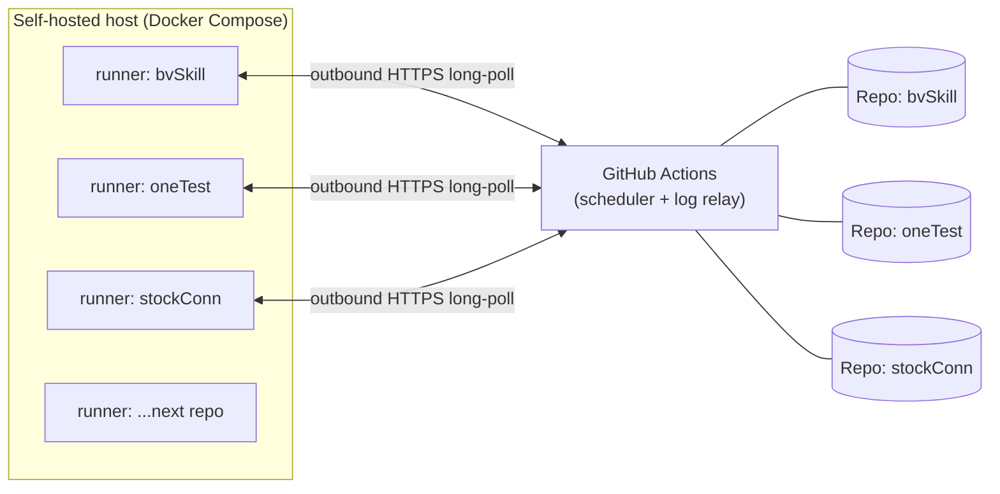
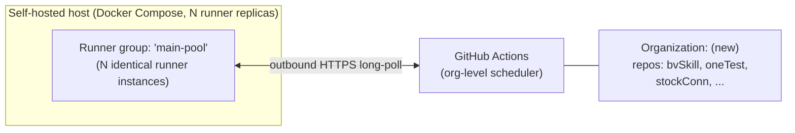

# 01 — Architecture

## How a self-hosted runner works (mechanism)

1. **Install** the `actions-runner` agent on a host you control (bare metal, VM, or
   container).
2. **Register** it against a scope (repo / org / enterprise) using a short-lived
   registration token minted via the GitHub API or the Settings UI.
3. The runner opens an **outbound** long-poll HTTPS connection to GitHub — no
   inbound port, no public IP, works behind NAT/firewall as-is.
4. When a queued job's `runs-on:` labels match the runner's labels, GitHub pushes
   the job assignment down that connection.
5. The runner executes every step **locally**, on your CPU/RAM/disk.
6. Logs stream back to GitHub in near-real-time; the PR checks UI is indistinguishable
   from a GitHub-hosted run.
7. The runner goes idle (persistent mode) or de-registers (ephemeral mode) and waits
   for the next job.

GitHub's role is reduced to *scheduling and log relay*. None of the job's compute
happens on GitHub's infrastructure, so none of it is metered against Actions
minutes — this is true on every plan, including Free, and is not expected to
change (a proposed $0.002/min self-hosted platform fee was announced 2025-12-16 and
withdrawn within 48 hours; see `README.md` for the source).

## Registration scope comparison

| Scope | Who can create it | Runner pool shared across | Requires |
|---|---|---|---|
| **Repository** | Any repo admin, including personal accounts | That one repo only | Nothing extra |
| **Organization** | Org owners | Every repo in the org (via runner groups) | A GitHub Organization (free tier is enough) |
| **Enterprise** | Enterprise admins | Every org in the enterprise | GitHub Enterprise Cloud |

`ephoton0210` is a personal user account, so only the repository scope is available
today. This is the constraint from [00_OVERVIEW.md](00_OVERVIEW.md) — it is why the
design has two phases instead of one.

## Phase 1 — repository-scoped runner fleet (works today, no account changes)

One host runs **one runner-agent instance per target repository**, as independent
processes/containers, all sharing the same host's Docker layer cache and hardware.
GitHub still sees N separate runner registrations, but operationally it behaves like
one fleet because it is deployed and managed as a single unit.

Trade-offs accepted in Phase 1:

- **Registration sprawl** — adding a new target repo means adding a new compose
  service + a new registration token, not just relabeling `runs-on:`.
  [02_DEPLOYMENT_DESIGN.md](02_DEPLOYMENT_DESIGN.md) covers how the repo list is
  kept declarative to make this a one-line change, not a manual runbook.
- **No cross-repo runner-group access policy** — since each runner belongs to one
  repo already, there's nothing to gate; access control is inherent to the scope.
- **Concurrency is per-runner, not per-host** — a repo with N parallel jobs (like the
  4-way `backend-check` fan-out seen in practice) needs N *registered instances for
  that repo*, not just N containers; see the concurrency note in
  [02_DEPLOYMENT_DESIGN.md](02_DEPLOYMENT_DESIGN.md).

## Phase 2 — organization-scoped runner group (true account-wide pool)

Move the target repositories (or at minimum, create new ones) inside a GitHub
Organization — this is free and does not require GitHub Team/Enterprise for basic
org-level runner groups. Register the runner fleet once, at the org level, with a
runner group whose repository-access policy lists the member repos. Every repo in
the org then shares one pool; adding a new repo to the runner group is a UI/API
change, not a new runner registration.

This is the only architecture that matches the original ask — "handle the whole
account's GitHub Actions" — literally. It is staged as Phase 2 because migrating
repo ownership from a personal account into an org is a real structural change
(admin transfer, any hard-coded `github.com/ephoton0210/...` URLs, collaborator
permissions) that deserves to happen deliberately, after Phase 1 has proven the
runner mechanics work. See [04_ROADMAP.md](04_ROADMAP.md) for sequencing.

## Job execution: container vs bare metal

Both phases use **ephemeral, containerized runners** (one container = one job, then
destroyed) rather than long-lived bare-metal installs. Rationale:

- No state drift between jobs (GitHub-hosted parity) without manually scripting
  workspace cleanup.
- Trivial to run multiple isolated instances on one host via Compose.
- Version pinning and updates are an image rebuild, not a fleet-wide SSH-and-patch.

The concrete container image, Compose layout, and token-refresh mechanism are
specified in [02_DEPLOYMENT_DESIGN.md](02_DEPLOYMENT_DESIGN.md).
